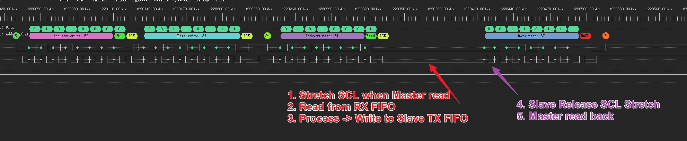

## ESP I2C Slave Driver

The driver port from `arduino-esp32`, which supports I2C slave SCL stretching. 

## Tested Target

* ESP32-S2
* ESP32-S3

## Stretch test result

1. Stretch SCL when Master read
2. Read from RX FIFO
3. Process -> Write to Slave TX FIFO
4. Slave Release SCL Stretch
5. Master read back

